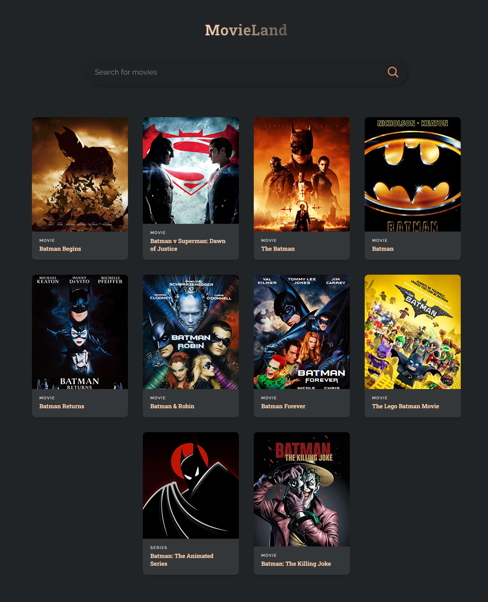

# MOVIELAND

🎥 Projeto realizado através do canal do Youtube JavaScript Mastery. O propósito do vídeo é fazer um projeto chamado "Movieland" utilizando React para estudar alguns conceitos e praticar a biblioteca.

Project based on Javascript Mastery's Youtube Channel. The pupose of the video is making a project called "Movieland" utilizing React to study some of the concepts and practice the library.

📌 Key concepts covered (Principais conceitos abordados):
- Components 
- Properties
- Hooks: useEffect, useState
- Callback Function
- Arrow Function 
- Events: onClick, onChange
- Debounce 

💻 Como rodar o projeto localmente:
Ao realizar o clone do repositório, é necessario rodar o comando `npm install` no diretório do projeto. Em seguida, é só rodar `npm run start` para servir o projeto localmente. 

After cloning the repository, it's necessary to run `npm install` on the project directory. Then, just run `npm run start` to serve locally.

🔗 Links úteis:
Youtube vídeo: https://www.youtube.com/watch?v=b9eMGE7QtTk

Desenvolvido com 💘 por Natasha Limeres
